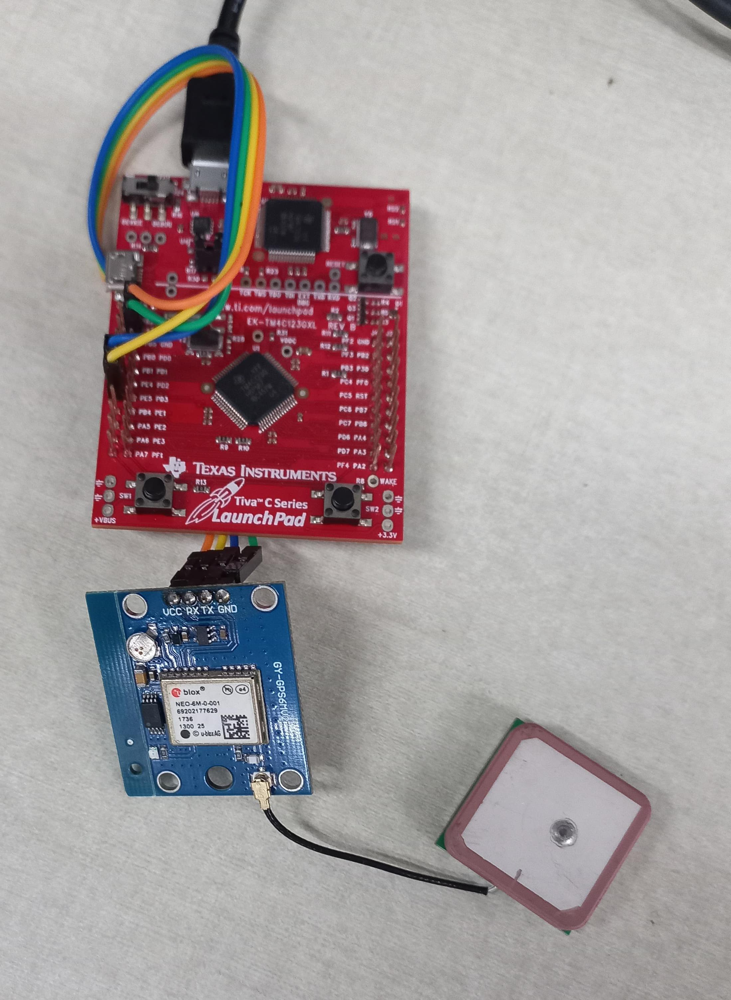
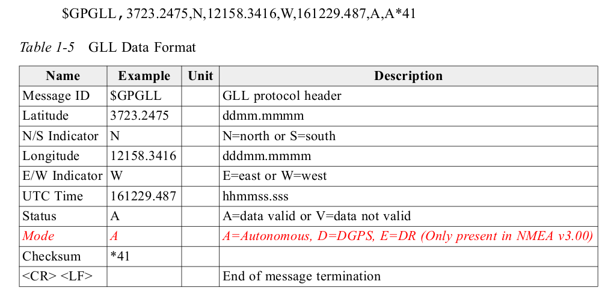
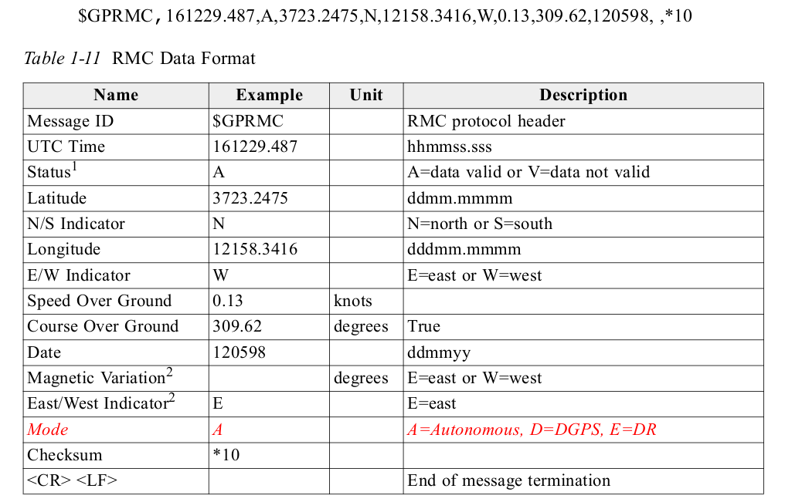
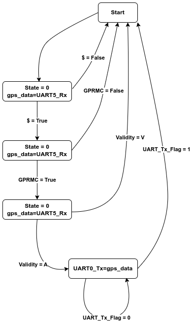
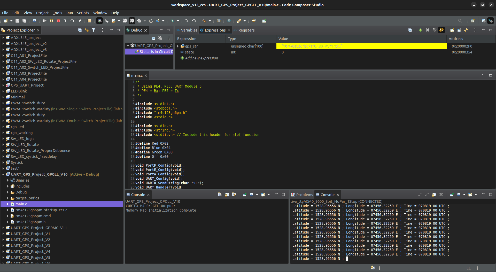
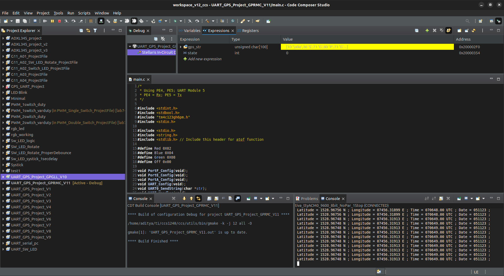
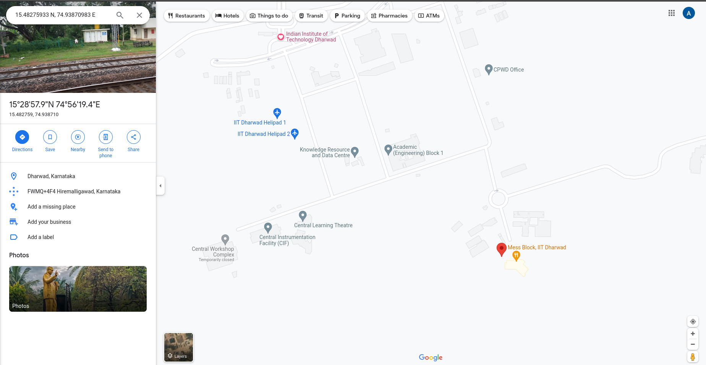

# Embedded Systems Design Mini Project: Interfacing TM4C123GH6PM microcontroller with NEO-6 GPS Module

Group 11: EE23DP001 Aditya Shirodkar; EE23MS006 Prasanth Pithanisetty

## Aim:
To interface the TM4C123GH6PM microcontroller with NEO-6 GPS Module using UART, parse recieved data and display the same using serial monitor.

## Procedure:
1. Configure Port E corresponding to UART module 5 for interfacing with GPS module
2. Configure UART module 5 to recieve data from GPS module (NEO-6 GPS Module datasheet)
3. Recieved data from NEO-6 GPS Module, and parse recieved data.
4. Configure Port A corresponding to UART module 0 for transimitting parsed data to serial monitor.

## Program Description:
### UART Protocol for recieving data from NEO-6 GPS Module:

    

    NEO-6 GPS Module connected to TM4C123GH6PM microcontroller

From the NEO-6 GPS Module datasheet, it is seen that
* By default, the module transmits through UART with 9600 Baud, 8 bits, no parity bit, 1 stop bit
* On start-up, the module transmits data in a preset default configuration.
* It follows NMEA protocol; sends data in GSV, RMC, GSA, GGA, GLL, VTG and TXT formats.

Hence, UART Module 5 is configured at 9600 Baud, 8 bits, no parity bit, 1 stop bit.

* UART Module 0 is configured at 9600 Baud, 8 bits, no parity bit, 1 stop bit.
* CodeComposerStudio serial monitor is set to same parameters (9600 Baud, 8 bits, no parity bit, 1 stop bit).

### State Machine:
Once the configuration of UART modules is complete, a state machine is built for recieving the desired data from GPS module.
The state machine is written as follows:
* Start: Go to state 1
* State 1: Check for "$"; If recieved, go to state 2; if not, go to Start
* State 2: Check for "GPGLL" (if reading GPGLL data). If GPGLL recieved, go to state 3; else, go to start
* State 3: Keep recieving data till "\r" is recieved

Once data is recieved, it is used as Comma Seperated Values and parsed into various components such as Format, Latitude, Longitude, Time etc as defined for GPGLL by the datasheet.
The same process is repeated for GPRMC data. Here, the condition for "GPGLL" is just replaced by "GPRMC". The various states are debugged by using RGB LEDs as status LEDs.

The data format recieved for GPGLL and GPRMC are shown below:

For GPGLL:

    

For GPRMC:

    

### StateFlow Diagram:
For GPGLL:

    

For GPRMC:

    

## Results and Conclusion:
* Data is collected from the NEO-6 GPS Module successfully using UART communication protocol.
* The data is parsed and seperated for individual use
* For GPGLL format, received Longitude, Latitude and UTC time is then sent to PC through UART based serial communication.
* For GPRMC format, received Longitude, Latitude, UTC time and Date is then sent to PC through UART based serial communication.

    

    Data obtained from NEO-6 GPS Module in GPGLL format, parsed and sent to PC over UART; as seen in serial terminal of Code Composer Studio

    

    Data obtained from NEO-6 GPS Module in GPRMC format, parsed and sent to PC over UART; as seen in serial terminal of Code Composer Studio

    

    The coordinates recieved from the GPS module in GPGLL format are "15.48275933 N; 74.93870983 E". The recieved latitude and longitude coordinates are fed into google maps; and the obtained data is verified.

