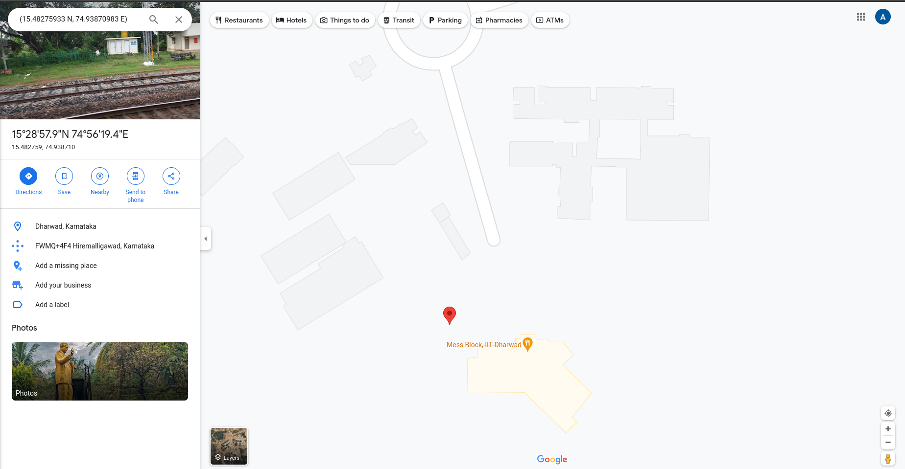

# Embedded Systems Design Mini Project: Interfacing TM4C123GH6PM microcontroller with NEO-6 GPS Module

Group 11: EE23DP001 Aditya Shirodkar; EE23MS006 Prasanth Pithanisetty

## Aim:
To interface the TM4C123GH6PM microcontroller with NEO-6 GPS Module using UART, parse recieved data and display the same using serial monitor.

## Procedure:
1. Configure Port E corresponding to UART module 5 for interfacing with GPS module
2. Configure UART module 5 to recieved data from GPS module (NEO-6 GPS Module datasheet)
3. Recieved data from NEO-6 GPS Module, and parse recieved data.
4. Configure Port A corresponding to UART module 0 for transimitting parsed data to serial monitor.

## UART Protocol for recieving data from NEO-6 GPS Module:

    

    NEO-6 GPS Module connected to TM4C123GH6PM microcontroller

From the NEO-6 GPS Module datasheet, it is seen that
* By default, the module transmits through UART with 9600 Baud, 8 bits, no parity bit, 1 stop bit
* On start-up, the module transmits data in a preset default configuration.
* It follows NMEA protocol; sends data in GSV, RMC, GSA, GGA, GLL, VTG and TXT formats.

Hence, UART Module 5 is configured at 9600 Baud, 8 bits, no parity bit, 1 stop bit.

## UART Protocol for recieving data from NEO-6 GPS Module:
* UART Module 0 is configured at 9600 Baud, 8 bits, no parity bit, 1 stop bit.
* CodeComposerStudio serial monitor is set to same parameters (9600 Baud, 8 bits, no parity bit, 1 stop bit).

## StateFlow Diagram:

## Code:
        /*
        * Using PE4, PE5; UART Module 5
        * PE4 = Rx; PE5 = Tx
        */

        #include <stdint.h>
        #include <stdbool.h>
        #include "tm4c123gh6pm.h"
        #include <stdio.h>

        #include <stdio.h>
        #include <string.h>
        #include <stdlib.h> // Include this header for atof function

        #define Red 0X02
        #define Blue 0X04
        #define Green 0X08
        #define Off 0x00

        void PortF_Config(void);
        void PortE_Config(void);
        void PortA_Config(void);
        void UART_Config(void);
        void UART0_SendString(char *str);
        void UART_Handler(void);
        void Data_Parse(void);
        void Data_Send(void);

        char gps_str[100];
        char str[1];
        //state1 = wait for $; state2 = check for GPGLL; state3 = Read till '\r'; state4 = write to UART0
        volatile int state;
        volatile int pos=0;

        char latitudeResult[10], longitudeResult[10], parseValue[12][20], *token, date[9], *time, currentTime[9];
        double latitude = 0.0, longitude = 0.0, seconds = 0.0, result = 0.0, minutes = 0.0;
        const char sep[1] = ",";        //Data Separator
        int index = 0, degrees, i = 0, j = 0;

        void main(void)
        {
            SYSCTL_RCGCGPIO_R |= (1<<5);      //Enable and provide a clock to GPIO Port E
            SYSCTL_RCGCUART_R |= (1<<5);      //Enable and provide a clock to UART module 5 in Run mode
            SYSCTL_RCGCGPIO_R |= (1<<4);      //Enable and provide a clock to GPIO Port E
            SYSCTL_RCGCUART_R |= 0x01;        //Enable UART0
            SYSCTL_RCGCGPIO_R |= 0x01;        //Enable and provide a clock to GPIO Port A

            PortF_Config();
            PortE_Config();
            PortA_Config();
            UART_Config();

            while(1){
                Data_Parse();
                Data_Send();
                }
        }

        void Data_Parse(void)
        {
            /*Parse the GPS Data
            * 0 $GPGLL
            * 1 Latitude 1531.13797
            * 2 N
            * 3 Longitude 07455.55473
            * 4 E
            * 5 UTC Time 063153.00
            * 6 Data Valid A
            * 7 Mode and Checksum A*65
            * last character gps_str[50]
            */

            index = 0;
            token = strtok(gps_str, sep);       //Allots comma seperated data to different token numbers
            while (token != NULL)               //While token is not empty
            {
                //parseValue is a matrix where the data is stored token wise in rows
                strcpy(parseValue[index], token);   //Copy data from token to first row of parseValue
                token = strtok(NULL, sep);          //Make token empty
                index++;                            //Go to next row
            }
        }

        void Data_Send(void)
        {
            // If parseValue[6] = A, the data is valid. If V, the data is not valid.
            if (strcmp(parseValue[6], "A") == 0)
            {
                //Send Latitude
                UART0_SendString("Latitude = ");
                UART0_SendString(parseValue[1]);
                UART0_SendString(" ");
                UART0_SendString(parseValue[2]);
                UART0_SendString(" ");
                UART0_SendString(";");
                UART0_SendString(" ");

                //Send Longitude
                UART0_SendString("Longitude = ");
                UART0_SendString(parseValue[3]);
                UART0_SendString(" ");
                UART0_SendString(parseValue[4]);
                UART0_SendString(" ");
                UART0_SendString(";");
                UART0_SendString(" ");

                //Send Time
                UART0_SendString("Time = ");
                UART0_SendString(parseValue[5]);
                UART0_SendString(" ");
                UART0_SendString("UTC");
                UART0_SendString(" ");
                UART0_SendString(";");
                UART0_SendString(" ");

                UART0_SendString("\n \r "); //End Line
            }
        }

        void PortF_Config(void)
        {
            GPIO_PORTF_LOCK_R = 0x4C4F434B;     //Unlock PortF register
            GPIO_PORTF_CR_R = 0x1F;             //Enable Commit function

            GPIO_PORTF_PUR_R = 0x11;            //Pull-up for user switches
            GPIO_PORTF_DEN_R = 0x1F;            //Enable all pins on port F
            GPIO_PORTF_DIR_R = 0x0E;            //Define PortF LEDs as output and switches as input
        }

        void UART_Config(void)
        {
            /*
            *BRDI = integer part of the BRD; BRDF = fractional part
            *BRD = BRDI + BRDF = UARTSysClk / (ClkDiv * Baud Rate)
            *UARTSysClk = 16MHz, ClkDiv = 16, Baud Rate = 9600
            *BRD = 104.167; BRDI = 104; BRDF = 167;
            *UARTFBRD[DIVFRAC] = integer(BRDF * 64 + 0.5) = 11
            */

            //Port E (UART5) stuff
            UART5_CTL_R &= (0<<0);                       //Disable UART module 5
            UART5_IBRD_R = 104;
            UART5_FBRD_R = 11;
            UART5_CC_R = 0x00;                          //System Clock
            UART5_LCRH_R |= 0x60;                        //8 bit word length, FIFO disable, Parity disable
            UART5_CTL_R |= ((1<<0)|(1<<8)|(1<<9));      //Enable UART module 5

            //UART interrupt configuration
            UART5_IM_R &= ((0<<4)|(0<<5)|(0<<8));       //Mask Tx, Rx and Parity interrupts
            UART5_ICR_R &= ((0<<4)|(0<<5)|(0<<8));      //Clear Tx, Rx and Parity interrupts
            UART5_IM_R |= (1<<4);                       //Enable Rx interrupt
            NVIC_EN1_R |= (1<<29);                      //Interrupts enabled for UART5
            NVIC_PRI15_R &= 0xFFFF5FFF;                 //Interrupt Priority 2 to UART5

            //Port A (UART0) stuff
            UART0_CTL_R &= ~UART_CTL_UARTEN; // Disable UART0 during configuration
            UART0_IBRD_R = 104;              // Integer part of the baud rate
            UART0_FBRD_R = 11;               // Fractional part of the baud rate
            UART0_LCRH_R = (UART_LCRH_WLEN_8 | UART_LCRH_FEN); // 8-bit word length, enable FIFO
            UART0_CTL_R |= (UART_CTL_UARTEN | UART_CTL_RXE | UART_CTL_TXE); // Enable UART0, RX, and TX

            state=0;
        }

        void PortE_Config(void)
        {
            GPIO_PORTE_LOCK_R = 0x4C4F434B;     //Unlock PortE register
            GPIO_PORTE_CR_R = 0xFF;             //Enable Commit function
            GPIO_PORTE_DEN_R = 0xFF;            //Enable all pins on port E
            GPIO_PORTE_DIR_R |= (1<<5);         //Define PE5 as output
            GPIO_PORTE_AFSEL_R |= 0x30;         //Enable Alternate function for PE4 and PE5
            //GPIO_PORTE_AMSEL_R = 0;
            GPIO_PORTE_PCTL_R |= 0x00110000;    //Selecting UART function for PE4 and PE5
        }

        void PortA_Config(void)
        {
            // Port A configuration (UART pins)
            GPIO_PORTA_LOCK_R = 0x4C4F434B; // Unlock PortA register
            GPIO_PORTA_CR_R = 0xFF;         // Enable Commit function
            GPIO_PORTA_DEN_R = 0xFF;        // Enable all pins on port A
            GPIO_PORTA_DIR_R |= (1 << 1);    // Define PE1 as output
            GPIO_PORTA_AFSEL_R |= 0x03;      // Enable Alternate function for PE0 and PE1
            GPIO_PORTA_PCTL_R = (GPIO_PORTA_PCTL_R & 0xFFFFFF00) | 0x00000011; // Selecting UART function for PE0 and PE1
        }

        void UART0_SendString(char *str)
        {
            while (*str)
            {
                // Send each character of the string
                while ((UART0_FR_R & 0x20) != 0); // Wait until UART0 transmit flag is empty
                UART0_DR_R = *str; // Send the character
                str++;
            }
        }

        void UART_Handler(void)
        {
            UART5_IM_R &= (0<<4);       //Mask UART Rx interrupt

            if(state == 0)
            {
                GPIO_PORTF_DATA_R = Red;

                pos=0;
                gps_str[pos]=UART5_DR_R;
                if(gps_str[pos]=='$')
                {
                    state=1;
                    pos++;
                }
                else
                {
                    pos=0;
                    UART5_ICR_R |= (1<<4);                  //Clear UART Rx Interrupt
                    UART5_IM_R |= (1<<4);                   //UnMask UART Rx interrupt
                }
            }

            if(state == 1)
            {
                GPIO_PORTF_DATA_R = Blue;

                gps_str[pos]=UART5_DR_R;
                pos++;

                if(pos==7)
                {
                if((gps_str[2] == 'G')&&(gps_str[3] == 'P')&&(gps_str[4] == 'G')&&(gps_str[5] == 'L')&&(gps_str[6] == 'L'))
                {
                    state = 2;
                    pos--;

                    UART5_ICR_R |= (1<<4);                  //Clear UART Rx Interrupt
                    UART5_IM_R |= (1<<4);                   //UnMask UART Rx interrupt
                }
                else
                {
                    state = 0;
                    pos = 0;
                }
                }
            }

            if(state == 2)
            {
                GPIO_PORTF_DATA_R = Green;
                gps_str[pos]=UART5_DR_R;

                if((gps_str[pos]=='\r') || (gps_str[pos]=='\n'))
                {
                    state=0;
                    pos=0;
                }
                else
                {
                    pos++;
                }
            }

            GPIO_PORTF_DATA_R = Off;
            UART5_ICR_R |= (1<<4);                  //Clear UART Rx Interrupt
            UART5_IM_R |= (1<<4);                   //UnMask UART Rx interrupt

        }

## Results and Conclusion:
* Data is collected from the NEO-6 GPS Module successfuly using UART communication protocol.
* The data is parsed and seperated for individual use
* The recieved Longitude, Latitude and UTC time is then sent to PC through UART based serial communication.

    

    Data obtained from NEO-6 GPS Module, parsed and sent to PC over UART; as seen in serial terminal of Code Composer Studio

    The coordinates recieved are "15.48275933 N; 74.93870983 E" 

    

    The recieved latitude and longitude coordinates are fed into google maps; and the obtained data is verified.

